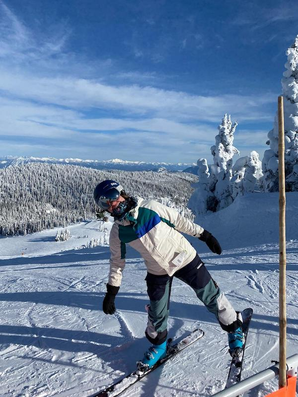

<h1 align='center'> Hi, my name is Suzanne 😎 </h1>

  🎓 I'm a General Assembly Software Engineering Grad 
 
  🌱 I’m currently learning all I can about MERN full stack development
  
  🐶 I was previously a small animal veterinary technician and I earned a BS in Wildlife and Fisheries Biology
  
  ☀️ I want to develop sustainable and impactful solutions that positively impact people and the planet
  

<h3>Tech I Like: </h3>

<h3>Say Hi:</h3>
 <a href="https://www.linkedin.com/in/suzanne-trammel/">
   
   
 </a>
 
<!--  -->
